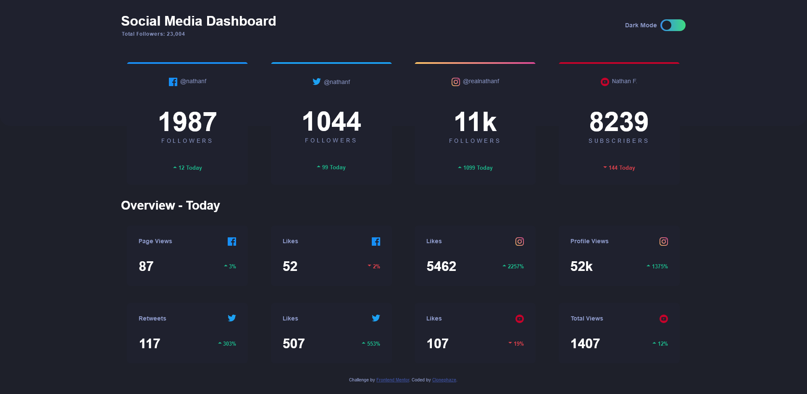

# Frontend Mentor - Social media dashboard with theme switcher solution

This is a solution to the [Social media dashboard with theme switcher challenge on Frontend Mentor](https://www.frontendmentor.io/challenges/social-media-dashboard-with-theme-switcher-6oY8ozp_H). Frontend Mentor challenges help you improve your coding skills by building realistic projects. 

## Table of contents

- [Frontend Mentor - Social media dashboard with theme switcher solution](#frontend-mentor---social-media-dashboard-with-theme-switcher-solution)
  - [Table of contents](#table-of-contents)
  - [Overview](#overview)
    - [The challenge](#the-challenge)
    - [Screenshot](#screenshot)
    - [Links](#links)
  - [My process](#my-process)
    - [Built with](#built-with)
    - [What I learned](#what-i-learned)
    - [Continued development](#continued-development)
  - [Author](#author)

## Overview

### The challenge

Users should be able to:

- ✔ View the optimal layout for the site depending on their device's screen size
- ✔ See hover states for all interactive elements on the page
- ✔ Toggle color theme to their preference

### Screenshot



### Links

- Solution URL: [Github](https://github.com/Clonephaze/FEC-Challenge-social-media-dashboard-with-theme-switcher)
- Live Site URL: [Github-Pages](https://clonephaze.github.io/FEC-Challenge-social-media-dashboard-with-theme-switcher/)

## My process

### Built with

- Semantic HTML5 markup
- CSS custom properties
- Flexbox
- Media queries
- JavaScript

### What I learned

In this project I explored 3 main things: Grid, easy theme switching, and css native nesting. I learned early on, I don't like grid and abbandoned it early on. The theme switching was easy with the javascript, but managing the color variables was new and now understandable. I may even implement the color thing in on the site I manage. And the css nesting, which until about 10 minute into this project I had no idea existed. I *love* css nesting, nesting media queries and child variables makes the css much cleaner to read in my opinion. Like in this section below, without nesting it would need to be 3 seperate entries, possibly ending up in seperate locations. 

```css
nav {
    min-height: 120px;
    display: flex;
    flex-direction: row;
    align-items: center;
    justify-content: center;

    & .nav-content {
        width: var(--content-max-width);     
        display: flex;
        flex-direction: row;
        align-items: center;
        justify-content: center;

        @media (max-width: 480px) {
            flex-direction: column;
            align-items: unset;
            margin-top: 2rem;
        }
    }
```

### Continued development

I think I'll take the time at some point to implement the color scheming I've learned into my own maintained project.

## Author

- Github - [Clonephaze](https://github.com/Clonephaze)
- Frontend Mentor - [@Clonephaze](https://www.frontendmentor.io/profile/Clonephaze)
